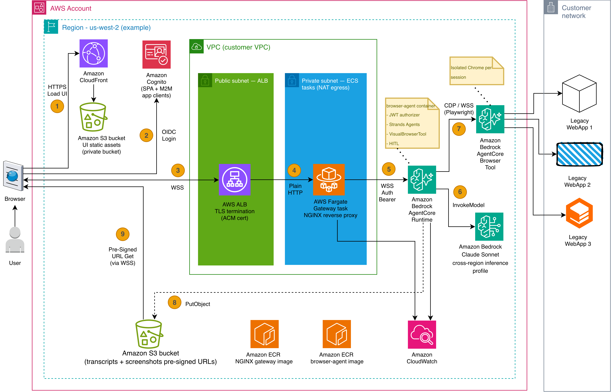
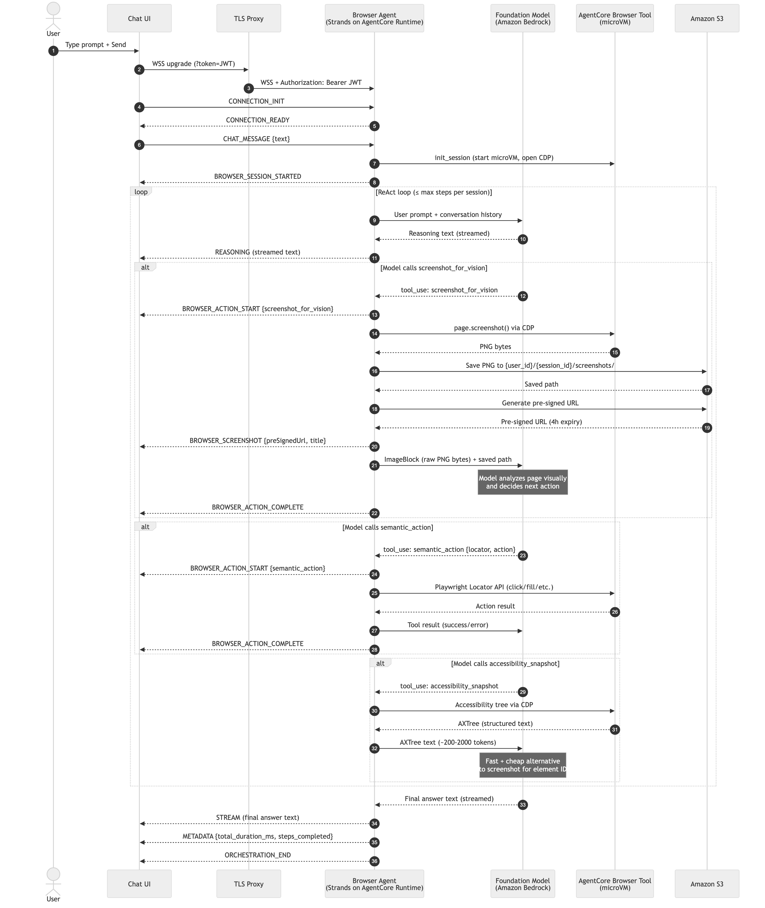
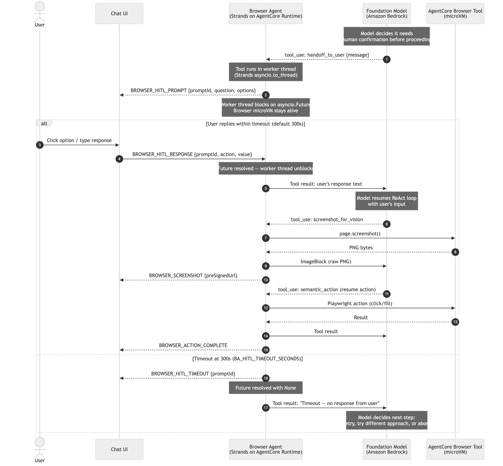

# AI-Powered Digital Worker — Public Reference Architecture

A reference implementation of an AI-powered digital worker that drives legacy web applications through a managed cloud browser. The solution uses Amazon Bedrock AgentCore Browser Tool for isolated microVM browser sessions, Strands Agents for model-driven orchestration, and Amazon Cognito for sign-in. The companion AWS blog post walks through the architecture, the code that wires the agent to a streaming chat UI, and the Terraform that deploys the whole thing on a personal AWS account — see [the published blog post](TODO: add published blog URL) for the full narrative.

> **Reference sample — not production-hardened.** This project is a teaching reference meant to be read, deployed to a personal account, and adapted. It ships sensible defaults (edge JWT auth, admin-create-only Cognito, CloudFront security headers, digest-pinned images, `LOG_LEVEL=ERROR`), but it intentionally leaves several hardening steps to you before any production or internet-facing use.

## Architecture

The diagram below shows the reference architecture end-to-end: a React single-page app on Amazon CloudFront, a TLS-terminating WebSocket proxy that injects the user's OIDC access token onto the WebSocket upgrade, a Strands Agents worker running on Amazon Bedrock AgentCore Runtime, and the managed browser microVM provided by Amazon Bedrock AgentCore Browser Tool. Amazon Cognito signs the user into the UI and issues the machine-to-machine tokens used by the integration test suite. Session state and screenshots land in Amazon S3 by default; Amazon DynamoDB is a drop-in alternative for session storage.



## Chat flow

This sequence traces a single user prompt from the chat input through the full loop: the UI opens a WebSocket, the browser agent initializes a browser microVM, the foundation model reasons over the task, each browser action streams start/complete frames interleaved with pre-signed screenshot URLs and reasoning traces, and the agent concludes with a final answer followed by a `METADATA` frame carrying `total_duration_ms` and `steps_completed`. Screenshots never travel inline on the wire — the agent saves the PNG bytes to Amazon S3 and forwards a short-lived pre-signed URL that the UI renders directly.



## Human-in-the-loop

This sequence shows what happens when the agent pauses mid-automation to ask the operator for a decision — for example, confirming that the right record was opened before a submit. The browser microVM stays alive the entire time, so clicking the chosen option simply resumes the same browser session. The agent waits up to 300 seconds (`BA_HITL_TIMEOUT_SECONDS`) for a response; if the operator doesn't reply in that window, a `BROWSER_HITL_TIMEOUT` frame is emitted and the agent decides whether to retry, try a different approach, or abort.



## Prerequisites

- AWS account with Amazon Bedrock model access for a **Claude Sonnet 4.5 or newer** cross-region inference profile in your target region (we've tested with Sonnet 4.5 and 4.6). The default is `us.anthropic.claude-sonnet-4-5-20250929-v1:0`; set `BA_BROWSER_MODEL_ID` to a newer Sonnet inference profile of your choice. Model access is granted per-account in the Amazon Bedrock console under **Bedrock → Model access**.
- AWS CLI v2 configured with credentials that can create Cognito, S3, CloudFront, ECR, ECS, CloudWatch, IAM, and Bedrock AgentCore resources.
- Docker 24+ (the Terraform apply builds and pushes two container images).
- Terraform 1.5 or newer.
- Node 20+ and Yarn (the UI is a Webpack bundle).
- Python 3.12 (for running the browser-agent-container tests locally).
- About 45 minutes for the first-time apply — CloudFront propagation and container builds dominate.

## Quick start

The reference implementation ships as a single `terraform apply` from `deployment/terraform/stacks/all/`. Five steps take you from `git clone` to a working chat URL.

### 1. Clone and check prerequisites

```bash
git clone <repo-url> blog-reference-architecture
cd blog-reference-architecture

# Confirm AWS CLI is authenticated
aws sts get-caller-identity

# Confirm Docker is running
docker info > /dev/null && echo "Docker OK"

# Confirm toolchain versions
terraform version     # expect >= 1.5
node --version        # expect >= v20
yarn --version
python3 --version     # expect 3.12.x
```

Before the first apply, open the Amazon Bedrock console in your target region and enable model access for your chosen Claude Sonnet 4.5-or-newer inference profile (the default is `us.anthropic.claude-sonnet-4-5-20250929-v1:0`) under **Bedrock → Model access → Modify model access**. Cross-region inference requires model access in the target region plus the `us-*` regions the profile spans.

### 2. Fill in `terraform.tfvars`

```bash
cp deployment/terraform/stacks/all/terraform.tfvars.sample \
   deployment/terraform/stacks/all/terraform.tfvars
```

Edit the copy and set at least these fields:

- `aws_region` — target AWS region (for example `us-west-2`).
- `project_name` — short lowercase prefix used for every resource (for example `blog-ref`).
- `cognito_domain_prefix` — must be globally unique within the region (for example `<project_name>-<your-initials>`).
- Networking inputs — the stack does **not** provision a VPC. Supply an existing one:
  - `vpc_id`
  - `gateway_subnet_ids` — two private subnets for the Fargate tasks
  - `gateway_security_group_ids` — security group for the tasks (allow ingress from the ALB SG on the container port)
  - `alb_subnet_ids` — two public subnets for the ALB
  - `alb_security_group_ids` — security group for the ALB (allow ingress on 80/443 from the internet)
- `gateway_public_hostname` — public hostname for the gateway ALB (for example `gateway.example.com`). When set, Terraform attaches an ACM certificate to the ALB and the UI bundle is built with `wss://<this>/ws`. Leave empty for HTTP-only development mode (the UI loads and Cognito sign-in works, but sending a chat prompt fails because browsers refuse `ws://` from an `https://` origin).
- `route53_zone_id` — Route 53 hosted zone ID for the parent domain. When set together with `gateway_public_hostname`, Terraform creates the ACM cert-validation record and a gateway alias record automatically. Leave empty if your DNS is managed outside Route 53; set `manage_acm_certificate = false` and provide an existing `acm_certificate_arn` instead.
- `acm_certificate_arn` — only required when bringing your own cert (DNS outside Route 53). Leave empty when `manage_acm_certificate = true`.
- `browser_agent_image_tag`, `gateway_image_tag` — leave at the sample defaults (`linux-arm64` and `linux-amd64`). The `scripts/docker_build_ecr.sh` + `scripts/docker_push_ecr.sh` pair pushes images under these platform-suffixed tags.
- `environment_variables` — the `BA_*` map passed through to the AgentCore Runtime. The sample file has placeholders for every variable described in [browser-agent-container/README.md](./browser-agent-container/README.md). `BA_SESSION_STORE_BUCKET` is auto-derived from the session-store bucket — you do not need to set it.
- `gateway_environment_variables` — only `LOG_LEVEL` is meaningful. `BROWSER_AGENT_ARN` and `BROWSER_AGENTCORE_ENDPOINT` are auto-derived from the AgentCore Runtime ARN and `aws_region`.

The sample file has inline comments for every variable. No real AWS account IDs, ARNs, or domain names belong in a committed `terraform.tfvars`.

### 3. Deploy infrastructure

The stack uses a two-pass apply because the AgentCore Runtime and ECS service need container images in ECR before they can start, and the same Terraform run creates the ECR repos. Pass 1 creates the repos so you have somewhere to push to; pass 2 brings up everything else.

```bash
cd deployment/terraform/stacks/all
terraform init

# Pass 1 — create ECR repositories only.
terraform apply \
  -target=module.browser_agent_ecr \
  -target=module.gateway_ecr
```

Now build and push both container images:

```bash
cd ../../../../browser-agent-container
./scripts/docker_build_ecr.sh
./scripts/docker_push_ecr.sh

cd ../gateway-container
./scripts/docker_build_ecr.sh
./scripts/docker_push_ecr.sh
```

Then come back and apply the full stack:

```bash
cd ../deployment/terraform/stacks/all
terraform apply
```

The full apply provisions the Cognito User Pool and hosted UI, the CloudFront distribution and UI bucket, the gateway ALB + ECS Fargate service, the AgentCore Runtime with a Cognito-backed JWT authorizer, the S3 sessions bucket, and (when `gateway_public_hostname` + `route53_zone_id` are set) the ACM certificate plus Route 53 records for the gateway. First apply takes around 20–30 minutes — CloudFront propagation (5–10 minutes) and ACM DNS validation (1–5 minutes) dominate. Cognito callback URLs and the gateway env vars are wired automatically from Terraform outputs, so there is no manual placeholder edit between apply and sign-in.

### 4. Deploy the UI

```bash
./deploy-ui.sh
```

The script reads `terraform output -json`, builds `chat-bot-ui/` with the OIDC authority, client ID, and gateway WebSocket URL baked in, syncs `dist/` to the UI bucket, and issues a CloudFront invalidation. ~3–5 minutes.

If you want to iterate on a single piece without re-running anything else, the helper scripts above run independently:

```bash
# Rebuild and push the browser-agent image (then trigger an AgentCore update)
./browser-agent-container/scripts/docker_build_ecr.sh
./browser-agent-container/scripts/docker_push_ecr.sh

# Rebuild and push the gateway image (then trigger an ECS rolling deploy)
./gateway-container/scripts/docker_build_ecr.sh
./gateway-container/scripts/docker_push_ecr.sh

# Rebuild and redeploy just the UI
./deployment/terraform/stacks/all/deploy-ui.sh
```

### 5. Sign in and try it

```bash
# Grab the CloudFront URL
terraform -chdir=deployment/terraform/stacks/all output -raw cloudfront_domain

# Create a Cognito user (replace placeholders with your values)
aws cognito-idp admin-create-user \
  --user-pool-id "$(terraform -chdir=deployment/terraform/stacks/all output -raw cognito_user_pool_id)" \
  --username <your-email> \
  --user-attributes Name=email,Value=<your-email> Name=email_verified,Value=true \
  --temporary-password '<TempPass123!>'
```

Open the CloudFront URL in a browser, sign in, and send a prompt such as `Search Wikipedia for 'Amazon Rainforest' and summarize the top result.`. You should see the reasoning trace stream into the chat view, screenshots appear next to each step, and a final answer render in a summary card. Total time from `git clone` to signed-in chat is typically 30–45 minutes on a first apply.

## TLS for the gateway

The chat UI talks to the agent over a WebSocket. Browsers refuse `ws://` from an `https://` origin (mixed-content blocking), so the deployed UI needs `wss://`, which means the gateway ALB needs a TLS certificate on a hostname you control. The stack supports three paths.

### Path 1 — Route 53 + auto-managed cert (recommended)

If your DNS is in Route 53 in the same AWS account as the deployment, set three variables in `terraform.tfvars`:

```hcl
gateway_public_hostname = "gateway.example.com"
route53_zone_id         = "Z0XXXXXXXXXXXXXXXXXX"
manage_acm_certificate  = true
```

`terraform apply` requests an ACM certificate for `gateway_public_hostname`, creates the validation CNAME in your Route 53 zone, waits for ACM to issue the cert (usually under five minutes), creates an A-record alias from the hostname to the ALB, and attaches the cert to the ALB's HTTPS listener with HTTP→HTTPS redirect. After apply, run `./deployment/terraform/stacks/all/deploy-ui.sh` so the UI bundle picks up the new `wss://` URL.

### Path 2 — bring your own cert (DNS outside Route 53)

If your DNS is at a third-party registrar (Namecheap, Cloudflare, GoDaddy, etc.), do the cert and DNS steps manually once:

1. Request the cert via `aws acm request-certificate --domain-name gateway.example.com --validation-method DNS --region <your-region>`.
2. Add the validation CNAME at your registrar (the AWS console shows the record under **ACM → your cert**).
3. After the cert reaches `Issued`, set in `terraform.tfvars`:

   ```hcl
   gateway_public_hostname = "gateway.example.com"
   route53_zone_id         = ""
   manage_acm_certificate  = false
   acm_certificate_arn     = "arn:aws:acm:<region>:<account>:certificate/<id>"
   ```

4. `terraform apply`.
5. At your registrar, add a CNAME from `gateway.example.com` to the ALB DNS name (`terraform output -raw gateway_alb_dns_name`).
6. `./deployment/terraform/stacks/all/deploy-ui.sh`.

### Path 3 — HTTP-only (development only)

Leave `gateway_public_hostname` and `acm_certificate_arn` empty. The ALB runs on HTTP only. The UI loads and Cognito sign-in works, but sending a chat prompt fails at the WebSocket open because browsers block `ws://` from an `https://` origin. Useful for validating the auth chain without a domain. `deploy-ui.sh` prints a warning and proceeds anyway when this mode is detected.

## Directory layout

```
.
├── README.md                          # (this file)
├── LICENSE                            # MIT-0
├── CODE_OF_CONDUCT.md
├── CONTRIBUTING.md
├── browser-agent-container/           # Python + Strands Agents backend
├── chat-bot-ui/                       # React + MUI single-page app
├── gateway-container/                 # NGINX TLS-terminating proxy
├── docs/
│   └── images/                        # Architecture + flow diagrams
└── deployment/
    └── terraform/
        ├── modules/                   # 9 reusable modules
        └── stacks/
            └── all/                   # Single-apply consolidated stack
```

Each sub-project is independently deployable and has its own README, `.env.example`, and test suite. The `deployment/terraform/stacks/all/` stack wraps them into one apply.

## Switching identity providers

The UI and the AgentCore Runtime authorizer are IdP-agnostic — both only depend on the OIDC discovery document. Switching providers means changing the UI's DefinePlugin values at build time and the AgentCore Runtime's `jwt_discovery_url` and client/audience inputs. The table below covers the four providers the reference implementation has been exercised against.

| IdP           | `__OIDC_AUTHORITY__`                                                          | `__OIDC_AUDIENCE__`   | `__OIDC_SCOPE__`                  | Callback URL registration                                                                                                  | AgentCore Runtime inputs                                                                 |
|---------------|-------------------------------------------------------------------------------|-----------------------|-----------------------------------|----------------------------------------------------------------------------------------------------------------------------|------------------------------------------------------------------------------------------|
| Cognito       | `https://cognito-idp.<region>.amazonaws.com/<user-pool-id>`                   | *(empty)*             | `openid profile email`            | Add `https://<cloudfront-domain>/callback` (and `http://localhost:3000/callback` for local dev) to the SPA app client.      | `jwt_discovery_url = <authority>/.well-known/openid-configuration`, `jwt_allowed_clients = [<spa-id>, <m2m-id>]` |
| Auth0         | `https://<tenant>.auth0.com/`                                                 | `<api-identifier>`    | `openid profile email`            | Register the CloudFront URL (and localhost) under **Applications → Allowed Callback URLs**; match exactly including slash. | `jwt_discovery_url = <authority>.well-known/openid-configuration`, `jwt_allowed_audience = ["<api-identifier>"]` |
| Okta          | `https://<org>.okta.com/oauth2/<auth-server-id>`                              | `api://<uri>`         | `openid profile email`            | Add the CloudFront URL (and localhost) to the app's **Sign-in redirect URIs**; assign users to the application.            | `jwt_discovery_url = <authority>/.well-known/openid-configuration`, `jwt_allowed_audience = ["<api-uri>"]`      |
| Entra ID      | `https://login.microsoftonline.com/<tenant-id>/v2.0`                          | `api://<app-id-uri>`  | `api://<app-id-uri>/.default`     | Register the CloudFront URL under **App registrations → Authentication → Web redirect URIs**; grant admin consent.         | `jwt_discovery_url = <authority>/.well-known/openid-configuration`, `jwt_allowed_audience = ["api://<app-id-uri>"]` |

Per-IdP troubleshooting:

- **Cognito** — `Invalid client_id` means the `__OIDC_CLIENT_ID__` baked into the UI bundle does not match the SPA app client ID created by Terraform; rebuild with the correct value. A redirect loop at `/callback` usually means the callback URL registered on the SPA app client does not match what the UI is requesting. Cognito access tokens carry `client_id` rather than `aud`, so `jwt_allowed_clients` (not `jwt_allowed_audience`) is the right authorizer setting.
- **Auth0** — if the proxy rejects the token as opaque rather than a JWT, `__OIDC_AUDIENCE__` was not set at build time and Auth0 returned an opaque access token; set the API identifier and rebuild. Callback mismatches here are usually trailing-slash differences — the registered URL must match the UI's request byte-for-byte.
- **Okta** — `Unauthorized` at the authorize endpoint typically means the user is not assigned to the application. The Okta default authorization server has to be enabled; if it is not, switch the authority to a custom auth server.
- **Entra ID** — the authority URL must end in `/v2.0`; without it the discovery document returns v1 token shapes that the client library cannot validate. The scope must be in the `api://<uri>/.default` form rather than a list of individual scopes.

For IdP-specific setup procedures the summary above does not cover, see [`gateway-container/docs/identity-provider-setup.md`](./gateway-container/docs/identity-provider-setup.md) and the multi-IdP smoke-test procedure in [`chat-bot-ui/tests/integration/README.md`](./chat-bot-ui/tests/integration/README.md).

## Switching the session store

The browser agent persists conversation transcripts and screenshots through a pluggable `SessionStore`. Three backends ship with the reference implementation; the choice is driven entirely by environment variables. Source of truth for the validation rules is [`browser-agent-container/src/utils/config_validator.py`](./browser-agent-container/src/utils/config_validator.py).

### `memory`

In-process dictionary. Use this for local development where a fresh state on every container restart is fine. No AWS permissions are required. Set `BA_SESSION_STORE_TYPE=memory`. The store is cleared whenever the container restarts, so this is not a production choice.

### `dynamodb`

Amazon DynamoDB table with one item per session. Use this when you want strict read-after-write consistency, fine-grained TTL, or lower per-request latency than S3. Set `BA_SESSION_STORE_TYPE=dynamodb` and `BA_SESSION_STORE_TABLE=<table-name>`. The container's task role needs `dynamodb:GetItem`, `dynamodb:PutItem`, `dynamodb:DeleteItem`, and `dynamodb:Query` on the table ARN. The table schema is documented in the `dynamodb` Terraform module under [`deployment/terraform/modules/dynamodb/`](./deployment/terraform/modules/dynamodb/).

### `s3`

Amazon S3 object per session, bucket encryption on, public access blocked. Use this as the default — it is simple, durable, and keeps the screenshot + transcript on the same storage surface. Set `BA_SESSION_STORE_TYPE=s3` and `BA_SESSION_STORE_BUCKET=<bucket-name>`. The container's task role needs `s3:GetObject` and `s3:PutObject` on `arn:aws:s3:::<bucket>/*`. Screenshot URLs are generated as pre-signed GETs with a lifetime controlled by `BA_SCREENSHOT_URL_EXPIRY_MINUTES` (default 240).

## Customizing the system prompt

The agent's system prompt lives in [`browser-agent-container/src/prompts/browser_system_prompt.py`](./browser-agent-container/src/prompts/browser_system_prompt.py). It is a plain Python string consumed by the Strands `Agent` constructor — no downstream schema or parser depends on its shape. To tune the agent's behavior, edit that file, rerun `pytest tests/unit/` from `browser-agent-container/` to catch prompt-related test regressions, rebuild the container image, and redeploy. `terraform apply` from `deployment/terraform/stacks/all/` picks up the new image and restarts the AgentCore Runtime.

## Extending the solution

The reference implementation deliberately leaves room for three common extensions. Each one is described in more detail in the "Extending the solution" section of the [published blog post](TODO: add published blog URL).

### Amazon Bedrock AgentCore Memory

The pluggable `SessionStore` is enough to resume a conversation mid-session after a disconnect, but it does not do semantic retrieval across sessions. Amazon Bedrock AgentCore Memory adds persistent short-term and long-term memory as a managed service, so the agent can carry operator preferences, prior decisions on similar records, or long-running context across multi-day workflows. It complements — or replaces — the session store when the workflow needs richer recall than transcript replay.

### Amazon Bedrock AgentCore Gateway

Amazon Bedrock AgentCore Gateway turns any REST API into an MCP tool the agent can call alongside its browser tools. The reference implementation focuses on the browser because that is where legacy-system friction lives, but real workflows usually need to read from or write to other enterprise systems too. Adding a new backend capability through AgentCore Gateway is a matter of pointing the Gateway at an OpenAPI spec rather than writing a new Strands tool.

### Browser profiles

Amazon Bedrock AgentCore Browser Tool supports persistent profiles with cookies, localStorage, and IndexedDB preserved across sessions. In the reference implementation every microVM starts clean; switching to a named profile means the operator signs into the legacy app once and the agent inherits that session for every subsequent turn. This is especially useful for applications with long-lived SSO sessions or step-up authentication prompts.

## Troubleshooting

- **JWT audience or client_id mismatch** — WebSocket closes with code 1008 immediately after the upgrade. For Cognito, confirm `jwt_allowed_clients` in Terraform matches both the SPA and M2M app client IDs. For Auth0, Okta, and Entra ID, confirm `jwt_allowed_audience` matches the API identifier the token was issued for. The UI's `__OIDC_AUDIENCE__` at build time must match the authorizer's expected audience.
- **Cognito callback URL mismatch** — redirect loop at `/callback` or a `redirect_uri` error on the hosted UI. The callback URL registered on the SPA app client must match what the UI requests byte-for-byte, including a trailing slash if there is one. For CloudFront the callback is `https://<distribution>/callback`; add `http://localhost:3000/callback` for local development.
- **Bedrock region availability** — the AgentCore Runtime fails to invoke with an access-denied error on the model. The Claude Sonnet cross-region inference profile requires model access in your target region and in the `us-*` regions the profile spans. Enable access under **Bedrock → Model access** in each region the inference profile covers.
- **Playwright install failure during Docker build** — the `browser-agent-container` image builds but fails on `pip install playwright`. The container does not install Chromium locally (the browser runs on AgentCore Browser microVMs). If the Python package install itself fails, check the pip index configuration and that `setup_pip.sh` produced a valid `/etc/pip.conf` inside the build.
- **WebSocket drops after about 15 seconds** — almost always traces back to the `nest_asyncio` issue described in the blog (`VisualBrowserTool._execute_async` override). If you see this on a customized fork, verify the override is still in place and that `asyncio.to_thread` is still the dispatch path for tool calls.
- **CloudFront serving 404 on deep links** — refreshing `/chat` or any non-root path returns a CloudFront 404 instead of the SPA. The `cloudfront-spa` module maps both 404 and 403 responses to `/index.html` with a 200 status; confirm those error-response rules are present in your distribution.

## License and attribution

- License: see [LICENSE](./LICENSE) — MIT-0.
- Built on Amazon Bedrock, Amazon Bedrock AgentCore (Runtime and Browser Tool), Strands Agents, React, Material-UI, NGINX, and Terraform.
- Contributions: see [CONTRIBUTING.md](./CONTRIBUTING.md).
- Conduct: see [CODE_OF_CONDUCT.md](./CODE_OF_CONDUCT.md).
